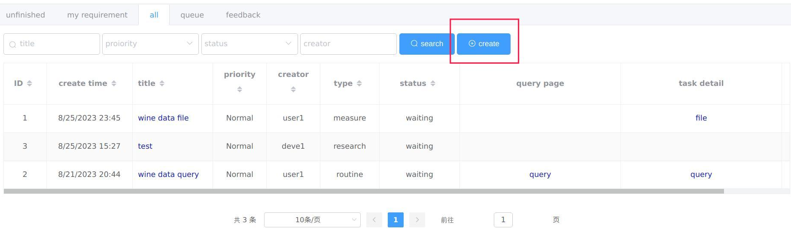
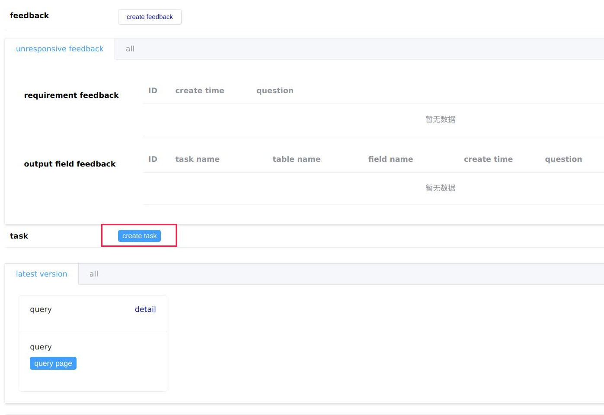
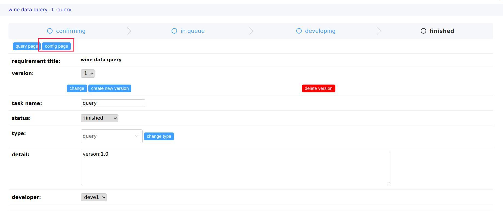
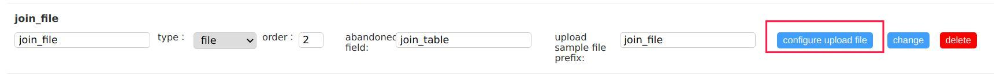
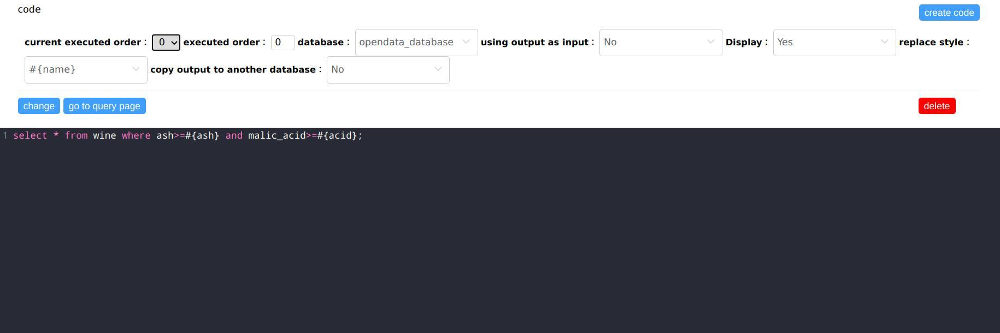

# Getting Started with `Data Analysis Platform`

* [Create a `requirement`](#create-a-requirement)
* [Create a `task`](#create-a-taskfor-developer)
* [Configure a `query task`](#configure-a-query-taskfor-developer)
* [Create a `feedback`](#create-a-feedback)
* [How to `query`](#how-to-quert)
* [Finish a `task`](#finish-a-taskfor-developer)
* [Finish a `requirement`](#finish-a-requirement)
* [Change a `requirement`](#change-a-requirement)
* [Change the order of `queue`](#change-the-order-of-queuefor-developer)
* [Dashboard](#dashboard)

## Create a `requirement`

Requirement are created by the users of this platform. After being created, developers should create one or more tasks attached to this requirement. Tasks can be file tasks or query tasks which results are excel/csv files or query pages representively.  

|field|description|
|-----|-----------|
|Title|The name of this requirement|
|Type|Just a label of this requirement(not represent its tasks should be query tasks or file tasks)|
|Proiority|Decide its tasks' default proiority|
|Description|The detail of this requirement| 
|Accessory|Normally are files using to describe the input and output fields|
|Accordance|Why user want to create this requirement.(Usually there are two sources of requirements, one is to reply the court's assisted investigation letter, and the other is to write a report)|
|Accordance Accessory| Files to proof the justify|
|Deadline|Deadline|

## Create a `task`(for developer)

Choose a requirement in the `requirement list` and roll down to the `task card`, click `create task` to create. The task usually created by the leader of the developer team and arrange it to the member.Then the choosen one will upload the data files or configure a query page for this task. 

|field|descripetion|
|-----|------------|
|Title|The name of this task|
|Proiority|Would impact its order in the `queue`(Three facts decide the order which is `proiority`,`create time`,`adjusted order`)|
|Type|File or query|
|Developer|the developer of this task|
|Description|The detail of this task|

## Configure a `query task`(for developer)

You can enter a task page and click `config page` to configure a `query task`.

A query task includes `Inputs`, `Outputs` and `SQL code`.
|part|function|
|----|--------|
|Input|Replace the placeholders in the SQL codes|
|File Input|Create temporary tables in the database and Insert the file data  to these tables|
|Output|Replace the field names of the results in excel files or web pages|
|SQL Code|Send to the databases and calculate the results|

### Configure Input

You can create,change or delete  `Input` at `config page`

|field|description|
|-----|-----------|
|Name|The name of the input|
|Type|Could be `string`,`date`,`time`,`number`,`file` or `list`. The first four only impact the replace method. The last two need more configuration  information to work|
|Description|The detail of this `Input`|
|Order|The order to display in the `query page`(relative order)|
|default|The default value in the `query page`. For `file input`, it means nothing|
|replace key|The placeholder in the SQL Code. For `file input`, it means the prefix name of the `sample file` and it ends with `.xlsx`|

To make `file` or `list` Input work. You need to click the `configure upload file`

A excel file could including one or more sheets. Any sheet will represent a temporary table. You need to create the tables as many as i you want. Then add fields to these tables
 
Create Table

|field|description|
|-----|-----------|
|using database|Which database to insert the excel sheet data|
|table name|The temporary table name of this sheet. If you using this table in `Oracle`, you should using placeholder to represent this table because there is not temporary talbe in Oracle. I using placeholders to protect table name confliction|
|excel sheet order|The order of this sheet in the excel file(relative order)|

Create Field

|field|description|
|-----|-----------|
|table name|Which sheet(temporary table name) dose this field attached to|
|field name|The name of this filed|
|data type|The data type of this field. It will replace `data type placeholder` in the Create Table SQL. |

### Configure Ouput

You have two ways to configure outputs.One is through web page. The other is uploading a excel file.

#### Web way

Create Table

|field|description|
|-----|-----------|
|name|the name of this table|
|order|the order of this table (relative order)|
|detail|the detail of this table|

Create Field

|field|description|
|-----|-----------|
|table|Which table is this field attached to|
|name|The name of this field|
|description|The detail of this field|
|replace original field|The original field name|

#### Upload way

You can upload a excel to configure the `Output`

For Table

|field|how to configure|
|-----|----------------|
|name|the sheet name of excel|
|order|the order of this sheet in excel|
|detail|no way to configure|

For Field

|field|how to configure|
|-----|----------------|
|table|the sheet it come from|
|name|the first row of this sheet|
|description|the second row of this sheet|
|replace original field|the third row of this sheet(future) |

### Configure Code

It is at the bottom of the `config page`.You can choose differenet SQL code using `current executed order` 

The SQL code is displayed in the black background editor.

|field|description|
|-----|-----------|
|executed order|the order of sql execution|
|database|the database it using|
|using output as input|Whether the result of this SQL will be using as input of the sql code after it.(Mostly NO)|
|display|Whether the result will be displayed(Mostly Yes)|
|replace style|the placeholder style, incluing `#{name}`, `%{name}s`,`&name` (Recommend `#{name}`)|
|copy output to another database|Mostly No,but some queries need the data from two different databases and they also have some relationship|

Next fields will be consided when  `copy output to another database` is Yes
|field|description|
|-----|-----------|
|from database|the database where the result data come from|
|to database|the database you want transport data to|
|table name| the name of the (temporary) table|
|whether create this table|Whether executing the Create Table SQL. Sometimes the table has already been created by the developer|
|whether create temporary table|whether you want to create a temporary table(using placeholder when you using Oracle)|

### Version of a task

### Download the configuration

### Upload the configuration

## Create a `feedback`

## How to `query`

## Finish a `task`(for developer)

## Finish a `requirement`

## Change a `requirement`

## Change the order of `queue`(for developer)

## Dashboard

There are two real-time data page displayed in the `Dashboard`.The data is randomly generated and transported by websockets. It is different from the production environment which data is read from the databases and compared with the one showed online and the backend will push the differences through websockets. 
