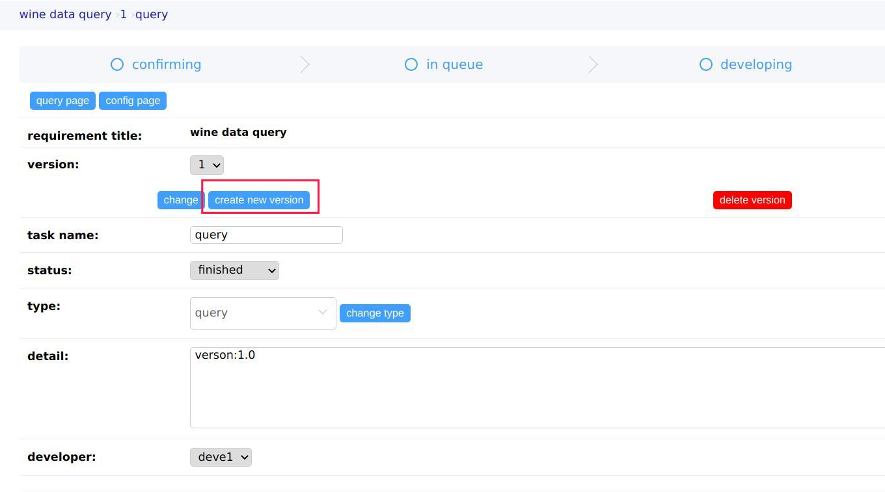
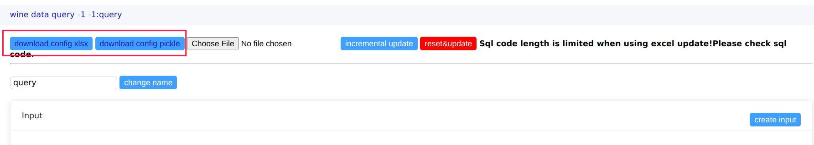
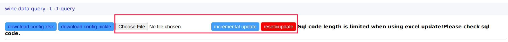
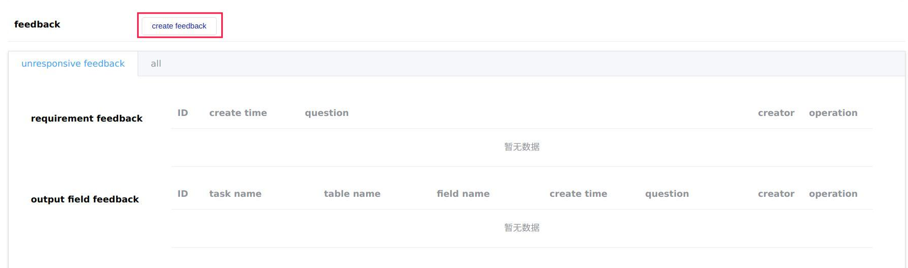
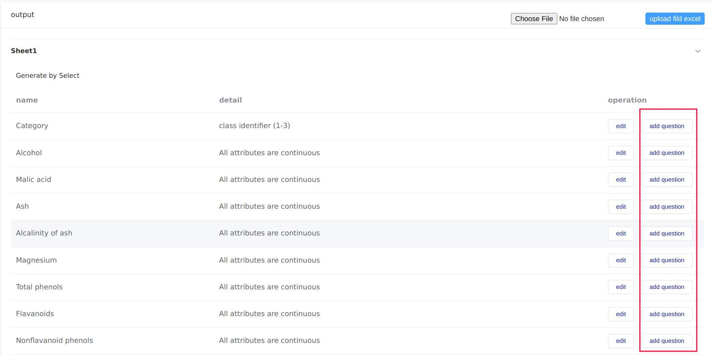
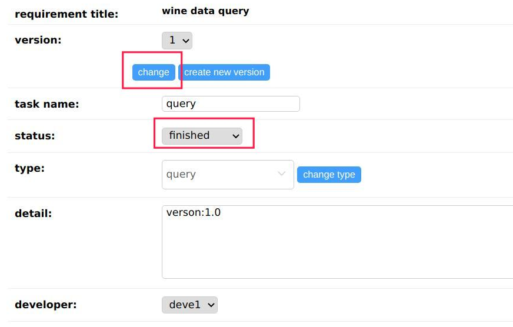
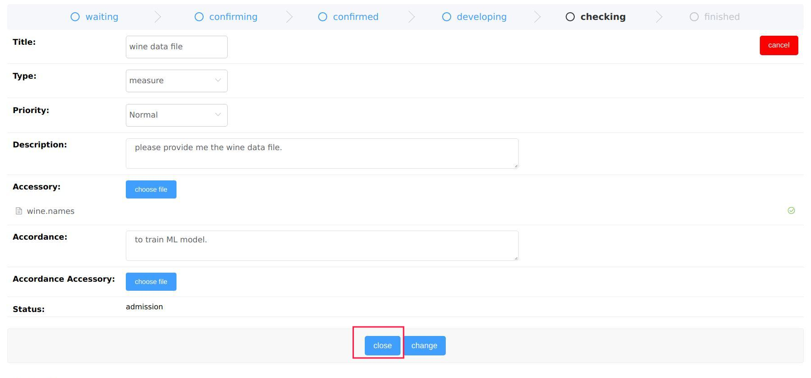

# Getting Started with `Data Analysis Platform`

* [Create a `requirement`](#create-a-requirement)
* [Create a `task`](#create-a-taskfor-developer)
* [Configure a `query task`](#configure-a-query-taskfor-developer)
* [Create a `feedback`](#create-a-feedback)
* [How to `query`](#how-to-quert)
* [Finish a `task`](#finish-a-taskfor-developer)
* [Finish a `requirement`](#finish-a-requirement)
* [Change a `requirement`](#change-a-requirement)
* [Dashboard](#dashboard)

## Create a `requirement`

Requirements are created by this platform users. After being created, developers should assign one or more tasks related to this requirement. Tasks can be file tasks or query tasks whose results are excel/csv files or query pages, respectively.

|field|description|
|-----|-----------|
|Title|The name of this requirement|
|Type|Just a label (not that its tasks should be query or file tasks)|
|Priority|Decide its tasks' default priority|
|Description|The details of this requirement| 
|Accessory|Normally used to describe input and output fields.
|Accordance|Why the user wants to create this requirement.(Usually there are two sources of requirements. One is to reply to the court's assisted investigation letter, and the other is to write a report)|
|Accordance Accessory| Files to prove the justify|
|Deadline|Deadline|

## Create a `task`(for developer)

Choose a requirement in the `requirement list` and roll down to the `task card`. Click `create task` to initiate. The task is usually created by the leader of the developer team and arrange it to the member. Then the chosen one will upload the data files or configure a query page for this task. 

|field|descripetion|
|-----|------------|
|Title|The name of this task|
|Proiority|Would impact its order in the `queue`(Three facts decide the order which is `priority`,`create time`,`adjusted order`)|
|Type|File or query|
|Developer|the developer of this task|
|Description|The details of this task|

## Configure a `query task`(for developer)

You can enter a task page and click `config page` to configure a `query task`.

A query task includes `Inputs`, `Outputs` and `SQL code`.

|part|function|
|----|--------|
|Input|Replace the placeholders in the SQL codes|
|File Input|Create temporary tables in the database and Insert the file data  to these tables|
|Output|Replace the field names of the results in excel files or web pages|
|SQL Code|Send to the databases and calculate the results|

### Configure Input

You can create, change or delete `Input` on `config page`.

|field|description|
|-----|-----------|
|Name|The name of the input|
|Type|Could be `string`,`date`,`time`,`number`,`file` or `list`. The first four only impact the replace method. The last two need more configuration information to work.|
|Description|The details of this `Input`|
|Order|The order displayed on the `query page`(relative order)|
|default|The default value on the `query page`. For `file input`, it means nothing.|
|replace key|The placeholder in the SQL Code. For `file input`, it means the prefix name of the `sample file` and it ends with `.xlsx`|
To make `file` or `list` Input work. You need to click on `configure upload file`.

Excel files may contain one or more sheets. Any sheet represents a temporary table. You can create as many tables as you want. Then add fields to these tables.
 
Create Table

|field|description|
|-----|-----------|
|using database|Which database to insert the excel sheet data|
|table name|The temporary table name of this sheet. If you using this table in `Oracle`, you should using placeholder to represent this table because there is not temporary talbe in Oracle. I using placeholders to protect table name confliction|
|excel sheet order|The order of this sheet in the excel file(relative order)|

Create Field

|field|description|
|-----|-----------|
|table name|Which sheet(temporary table name) dose this field attached to|
|field name|The name of this filed|
|data type|The data type of this field. It will replace `data type placeholder` in the Create Table SQL. |

### Configure Ouput

You have two ways to configure outputs. One is through a web page. A second option is to upload an Excel file.

#### Web way

Create Table

|field|description|
|-----|-----------|
|name|the name of this table|
|order|the order of this table (relative order)|
|detail|the detail of this table|

Create Field

|field|description|
|-----|-----------|
|table|Which table is this field attached to|
|name|The name of this field|
|description|The detail of this field|
|replace original field|The original field name|

#### Upload way

You can upload an Excel file to configure the `Output`.

For Table

|field|how to configure|
|-----|----------------|
|name|the sheet name of excel|
|order|the order of this sheet in excel|
|detail|no way to configure|

For Field

|field|how to configure|
|-----|----------------|
|table|the sheet it come from|
|name|the first row of this sheet|
|description|the second row of this sheet|
|replace original field|the third row of this sheet(future) |

### Configure Code

It is at the bottom of the `config page`. You can choose different SQL codes using `current executed order`. 

SQL code is displayed in the black background editor.

|field|description|
|-----|-----------|
|executed order|the order of sql execution|
|database|the database it using|
|using output as input|Whether the result of this SQL will be using as input of the sql code after it.(Mostly NO)|
|display|Whether the result will be displayed(Mostly Yes)|
|replace style|the placeholder style, incluing `#{name}`, `%{name}s`,`&name` (Recommend `#{name}`)|
|copy output to another database|Mostly No,but some queries need the data from two different databases and they also have some relationship|

The next fields that will be considered when `copy output to another database` are Yes.

|field|description|
|-----|-----------|
|from database|the database where the result data come from|
|to database|the database you want transport data to|
|table name| the name of the (temporary) table|
|whether create this table|Whether executing the Create Table SQL. Sometimes the table has already been created by the developer|
|whether create temporary table|whether you want to create a temporary table(using placeholder when you using Oracle)|

### Version control of the tasks

New versions of its tasks will also be created when the requirement is changed. The updated versions of these tasks are the same as the Older in inputs, outputs and SQL Code.
Developers can also create a new version of their tasks.But the configuration will not inherit from the older.

Creating a `new version` is the same as creating an `task`. If you were confused about the fields, you can see [Create a `task`](#create-a-taskfor-developer)

### Download the configuration

On the `config page`, you can download a task's configuration. 

If you want to download and modify it in an Excel file, you can use `download config excel`. The config excel has 4 sheets including `Inputs`, `Output Tables`, `Output Fields` and `SQL Code`. It is more like the form of configuration data in the web database.

There is a length limit for the execl cell. So please check your SQL code after uploading it. Some are too long.

If you just want to copy a task configuration, you can use `download config pickle`. It is a binary file generated by `pickle`.

### Upload the configuration

You can upload the configuration file to the backend. `incremental update` will not delete the existing data. `reset&update` will delete all the previous config data and insert the new.

You can choose the excel file or the pickle file you downloaded from the previous step.

## Create a `feedback`

The `feedback` is the developer's question to the user who created the request. `Feedback` can be divided into two types. One is about the requirement, the other is about the field.

About the requirement
It is on the `requirement` page

About the field
It is on the `task` page 

The user can answer the `feedback` on the `requirement` page. 

## How to `query`

Navigate to the query page of a query task. You can enter all the input parameters and click `execute`. Check the query history to see how the process went. If there were any file inputs, you can download a sample Excel first and modify it and then upload it.

The developer can also click `return SQL code` for testing.

## Finish a `task`(for developer)

Select the finished status on the task page and click the change button.

## Finish a `requirement`

Upon the developer changing the status of a requirement to accepting, the user can close it if the results are satisfactory.

## Change a `requirement`

Users can change their requirements if the result does not meet their expectations. Tasks attached to this requirement will have an updated version inherited from the old. 

## Dashboard

There are two real-time data pages displayed in the `Dashboard`. The data is randomly generated and transported by websockets. It is different from the production environment in which data is read from the database and compared with the one shown online. The backend will push the differences through websockets. 
